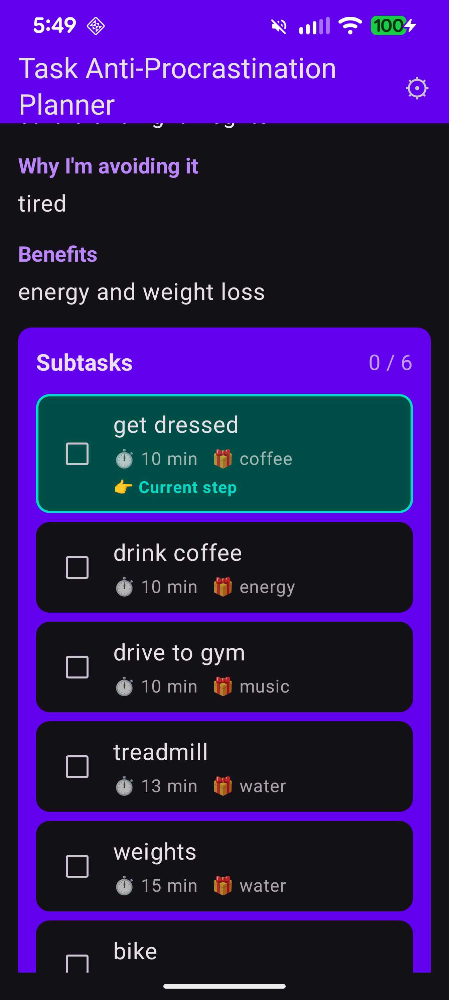
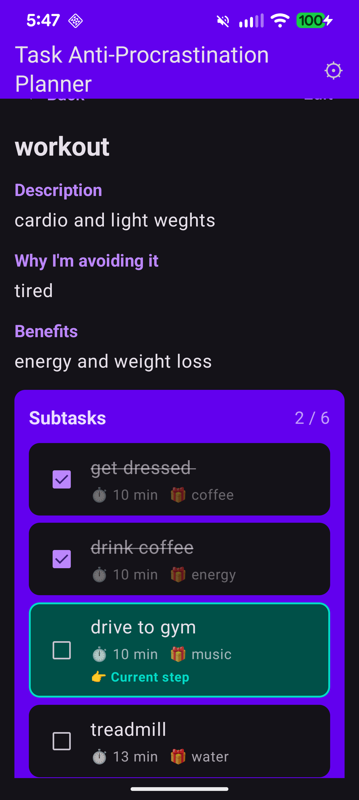
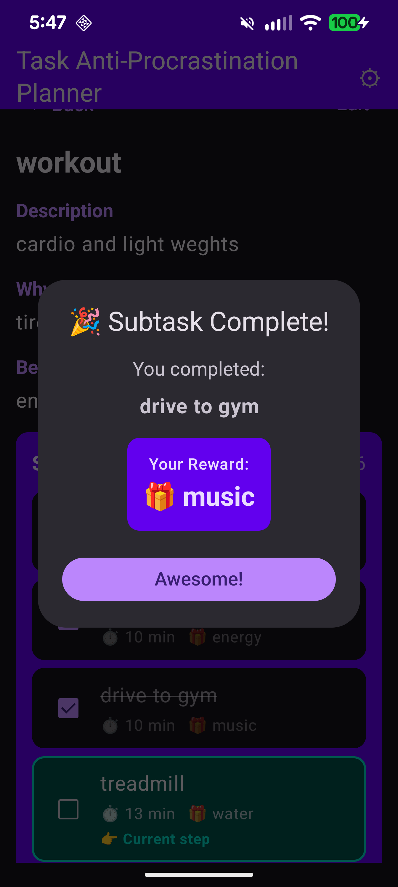
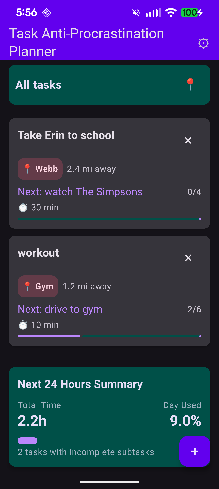
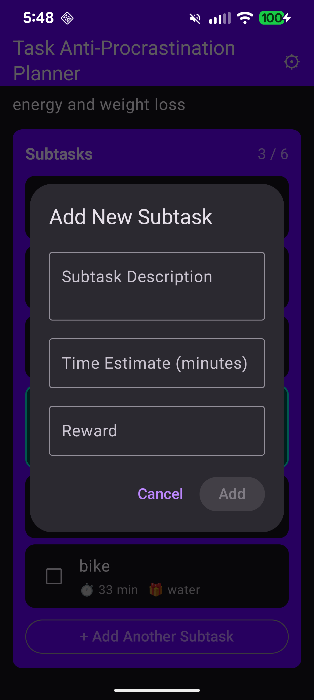
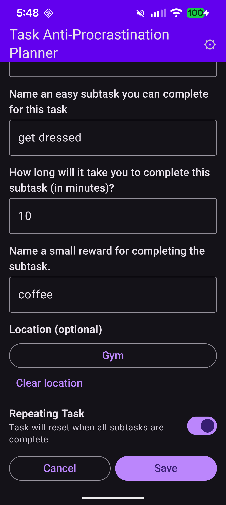
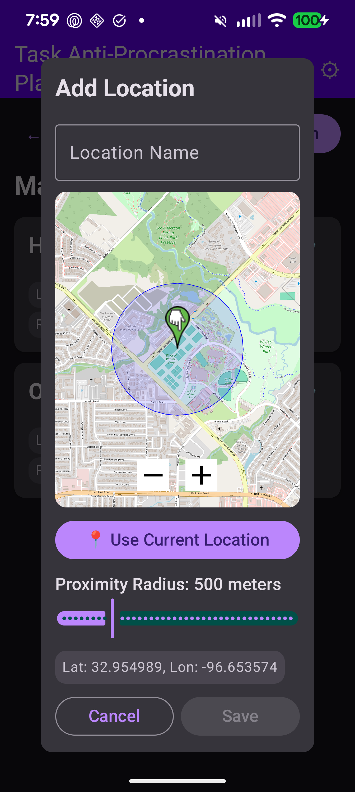
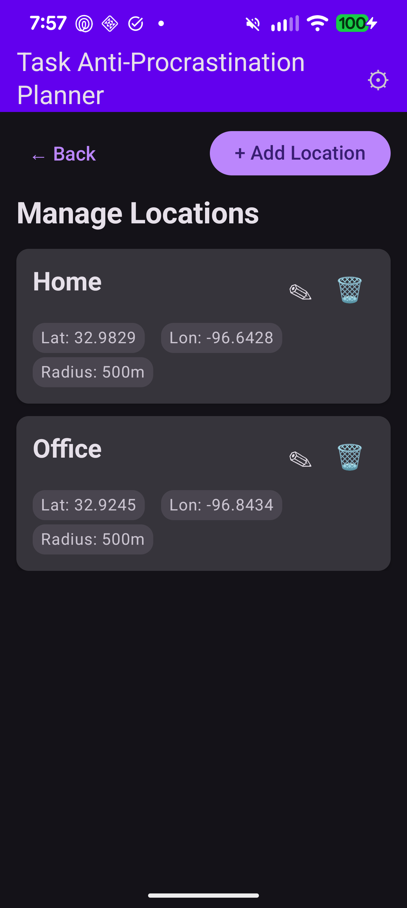
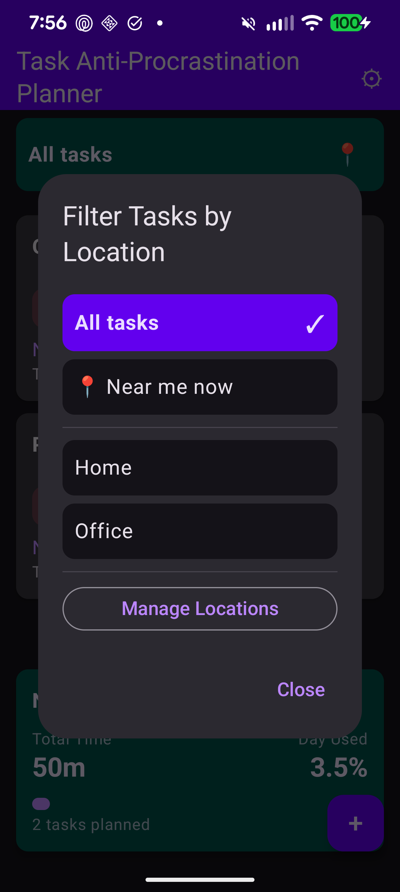
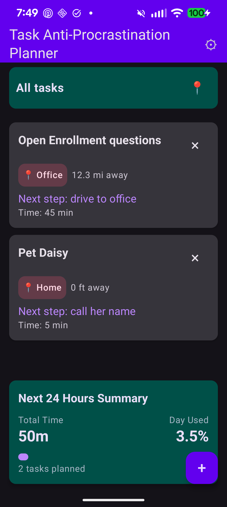

# TaskNow - Anti-Procrastination App

## Latest Update - Multi-Step Subtasks & Repeating Tasks (November 16, 2025)

### Summary of Changes

This update transforms the single-subtask system into a comprehensive multi-step workflow with repeatable task templates. Users can now break down tasks into multiple sequential steps, track progress with visual indicators, and automatically reset tasks for recurring activities like daily workouts.

### New Features

#### 1. Multi-Step Subtask System
- **Subtask Entity**: New database table for storing multiple subtasks per task with completion tracking
- **Sequential Workflow**: Tasks can have unlimited subtasks that users complete in order
- **Progress Tracking**: Visual progress bars and completion counters (X/Y completed)
- **Database Migration**: Updated from version 4 to version 5 to support repeating tasks

*Screenshot: Task detail showing multiple subtasks with completion status*

#### 2. Task Detail Screen Redesign
- **All Subtasks Visible**: Complete list of subtasks with checkboxes and completion status
- **Current Subtask Highlighting**: Next incomplete subtask gets special border and "👉 Current step" label
- **Completion Indicators**:
  - Completed subtasks show with strikethrough text
  - Grayed out appearance for completed items
  - Progress counter at the top (e.g., "3 / 5")
- **Time & Reward Display**: Each subtask shows ⏱️ time estimate and 🎁 reward

*Screenshot: Task detail with highlighted current subtask*

#### 3. Reward Celebration Dialog
- **Immediate Feedback**: Appears instantly when completing a subtask
- **Celebration UI**: "🎉 Subtask Complete!" title with task description
- **Reward Display**: Shows the earned reward in a highlighted card
- **Clean Dismissal**: Single "Awesome!" button to continue

*Screenshot: Reward celebration after completing a subtask*

#### 4. Updated Task Cards
- **Current Subtask Display**: Shows "Next: [subtask description]" instead of static text
- **Progress Bar**: Linear progress indicator showing completion percentage
- **Smart Counters**: Shows "X/Y" completion ratio
- **Completion Message**: "All subtasks complete! ✓" when task is done
- **Fallback Support**: Still displays old format for legacy tasks without subtasks

*Screenshot: Task card showing subtask progress*

#### 5. Add Subtask Functionality
- **"+ Add Another Subtask" Button**: Located at bottom of subtask list in task detail
- **Quick Entry Dialog**: Simple form with description, time estimate, and reward fields
- **Auto-Ordering**: New subtasks automatically added to end of sequence
- **Validation**: All fields required before saving

*Screenshot: Dialog for adding new subtasks*

#### 6. Uncomplete Subtasks
- **Bidirectional Toggle**: Click any subtask checkbox to toggle completion on/off
- **No Restrictions**: Can uncomplete previously completed subtasks
- **No Dialog on Uncomplete**: Only shows reward dialog when completing (not uncompleting)
- **Mistake Recovery**: Easy to fix accidental completions

#### 7. Repeating Tasks
- **Template System**: Tasks can be marked as "Repeating" during creation/editing
- **Auto-Reset Behavior**: When last subtask completes, all subtasks automatically reset to incomplete
- **Perfect for Routines**: Ideal for daily workouts, morning routines, recurring chores
- **Visual Toggle**: Clear switch in task form with explanation: "Task will reset when all subtasks are complete"
- **Seamless Flow**: Shows reward dialog, then resets task when dismissed

*Screenshot: Repeating task toggle in task creation form*

#### 8. Updated 24-Hour Summary
- **Incomplete Subtasks Only**: Now counts only incomplete subtasks (not all subtasks)
- **Accurate Time Calculation**: Reflects actual remaining work
- **Smart Task Count**: Shows "X tasks with incomplete subtasks" or "All subtasks complete!"
- **Dynamic Updates**: Automatically recalculates as subtasks are completed

### Technical Implementation

#### New Files
- `Subtask.kt` - Subtask entity with foreign key to Task, orderIndex, and completion tracking
- `SubtaskDao.kt` - Database queries for subtask operations and completion tracking
- `SubtaskRepository.kt` - Repository pattern for subtask CRUD operations

#### Modified Files
- `Task.kt` - Added `isRepeating` field for repeatable task templates
- `TaskDatabase.kt` - Updated to version 5, added Subtask entity
- `TaskViewModel.kt` - Added subtask operations and resetAllSubtasks logic
- `TaskRepository.kt` - Added SubtaskRepository for subtask management
- `MainActivity.kt` - Complete UI overhaul for subtask display, progress tracking, and repeating tasks

#### Key Technologies
- **Foreign Key Constraints**: Cascade delete ensures subtasks are removed with parent task
- **Room Database**: SQLite persistence with migration support (version 4→5)
- **Kotlin Flows**: Reactive UI updates when subtasks change
- **State Management**: LaunchedEffect for async progress calculations
- **Material Design 3**: Progress bars, checkboxes, and dialog components

### User Experience Improvements
- Clear visual hierarchy showing what to do next
- Immediate positive reinforcement with reward dialogs
- No need to recreate recurring tasks manually
- Easy mistake recovery with uncomplete functionality
- Progress visibility across all screens
- Backwards compatible with existing single-subtask tasks

---

## Previous Update - Location-Based Task Management (November 15, 2025)

### Summary of Changes

This update adds comprehensive location-based task filtering and management, allowing users to associate tasks with physical locations and filter tasks based on proximity to their current GPS position.

### New Features

#### 1. Location Management System
- **Location Entity**: New database table for storing saved locations with GPS coordinates and custom proximity radius
- **CRUD Operations**: Full create, read, update, delete functionality for locations
- **Database Migration**: Updated from version 2 to version 3 to include Location entity

#### 2. Interactive Map-Based Location Picker
- **OSMDroid Integration**: Added OpenStreetMap support for visual location selection
- **Long-Press Selection**: Users can long-press anywhere on the map to place a location marker
- **"Use Current Location" Button**: One-tap GPS capture to instantly grab current position
- **Visual Radius Display**: Blue circle overlay showing the proximity radius (50m - 2000m)
- **Adjustable Radius**: Slider to customize proximity range for each location
- **Real-time Feedback**: Toast messages for success/error states

*Screenshot: Interactive map interface for selecting locations*

#### 3. Task-Location Association
- **Optional Location Field**: Tasks can be assigned to saved locations during creation/editing
- **Location Picker Dialog**: Clean interface showing all saved locations
- **Clear Instructions**: Helpful messages guiding users to create locations via Settings

*Screenshot: Assigning a location to a task*

#### 4. Location-Based Task Filtering
- **Filter UI**: Card-based filter bar on main screen showing current filter status
- **Three Filter Modes**:
  - **All Tasks**: Show everything (default)
  - **Near Me Now**: GPS-based filtering showing tasks within proximity of current location
  - **By Location**: Filter by specific saved location
- **Permission Handling**: Runtime location permission requests with clear error messages
- **Filter Statistics**: Shows "X of Y tasks shown" when filter is active

*Screenshot: Filtering tasks by location*

#### 5. Location Indicators on Task Cards
- **Location Badge**: Colored pill showing 📍 icon + location name
- **Distance Display**: Shows distance from current location in:
  - Feet (if < 0.1 miles)
  - Miles with 1 decimal precision (if ≥ 0.1 miles)
- **Smart Display**: Only shows for tasks with assigned locations
- **Auto-Update**: Distance recalculates based on GPS position

*Screenshot: Task card showing location badge and distance*

#### 6. Settings Integration
- **Manage Locations Section**: Added to Settings screen
- **Location Count Display**: Shows number of saved locations
- **Easy Navigation**: One-tap access to full location management screen

*Screenshot: Settings screen with Manage Locations option*

### Technical Implementation

#### New Files
- `Location.kt` - Location entity with GPS coordinates and radius
- `LocationDao.kt` - Database access object for location operations
- `LocationService.kt` - GPS service with Haversine distance calculation
- `LocationRepository.kt` - Repository pattern for location data
- `MapLocationPicker.kt` - Composable map-based location picker UI

#### Modified Files
- `Task.kt` - Added `locationId` field (nullable)
- `TaskDatabase.kt` - Updated to version 3, added Location entity
- `TaskViewModel.kt` - Added location filtering logic and state management
- `MainActivity.kt` - Updated UI components for location features
- `AndroidManifest.xml` - Added location and internet permissions
- `build.gradle.kts` - Added OSMDroid dependency (v6.1.17)

#### Key Technologies
- **OSMDroid**: OpenStreetMap integration for map display and interaction
- **Android Location Services**: GPS positioning and permission handling
- **Haversine Formula**: Accurate distance calculation between GPS coordinates
- **Jetpack Compose**: Reactive UI with state management
- **Room Database**: SQLite persistence with migration support
- **Kotlin Coroutines**: Asynchronous location fetching

### Permissions Required
- `ACCESS_FINE_LOCATION` - For precise GPS positioning
- `ACCESS_COARSE_LOCATION` - Fallback location method
- `INTERNET` - For downloading map tiles
- `ACCESS_NETWORK_STATE` - Map tile network status
- `WRITE_EXTERNAL_STORAGE` - Map tile caching (API ≤ 32)

### User Experience Improvements
- No manual coordinate entry required
- Visual map interface for intuitive location selection
- Real-time distance calculations
- Clear permission request flow
- Helpful error messages and guidance
- Clean, uncluttered UI for tasks without locations

---

## A program written by Claude 4.5 as prompted by me via chat.

## Prompt 
>I want an android application that takes a list of tasks and builds a plan for further editing. It should use the following questions to gather the data. What task are you currently procrastinating on?
>Provide a brief description of the task.
>Why are you avoiding doing this task?
>What are the benefits of completing this task?
>Tasks can be broken down into subtasks. Name an easy subtask you can complete for this task
>How long will it take you to complete this subtask (in minutes)?
>Name a small reward for completing the subtask.

I'll help you create an Android application for task planning and procrastination management. This will be a complete, functional app using Kotlin with a modern UI.

## Update 1
>I want this app to use persistent storage in sqlite.

I've created a complete Android application for task planning and procrastination management! Here's what the app includes:
Key Features:

Task List View: Displays all your tasks with quick access to the next subtask and time estimate
Detailed Form: Asks all 7 questions you specified to gather comprehensive task information
Task Details: Shows a full breakdown of each task with an action plan section
Edit & Delete: Modify or remove tasks as needed
Modern UI: Uses Material Design 3 with a clean, intuitive interface

How it works:

Tap the + button to add a new task
Answer the 7 questions about your procrastination
View your task plan with the breakdown of avoidance reasons, benefits, and action steps
Edit or delete tasks as you complete them

To use this code:

Create a new Android Studio project with Kotlin and Jetpack Compose
Replace the MainActivity.kt content with this code
Make sure your build.gradle includes Compose dependencies
Update the package name to match your project

The app stores tasks in memory, so they'll persist during the session. If you'd like to add persistent storage (saving tasks between app sessions), let me know and I can add that functionality!RetryBI want this app to use persistent storage in sqlite.Task Anti-Procrastination AppCode ∙ Version 2 // build.gradle.kts (Module: app)
// Add these dependencies to your existing dependencies block:
/*
dependencies {
// Room dependencies
val room_version = "2.6.1"
implementation("androidx.room:room-runtime:$room_version")
implementatiPerfect! I've updated the app to use Room (Android's SQLite wrapper) for persistent storage. Now your tasks will be saved to the device's database and persist between app sessions.
What's new:

Room Database Setup: Uses SQLite through Room for type-safe database access
Task Entity: The Task data class is now a database table
TaskDao: Handles all database operations (insert, update, delete, query)
TaskRepository: Manages data operations between the database and UI
TaskViewModel: Handles lifecycle-aware data management with coroutines

## Update 2
>Can you change the package name to com.billybobbain.tasknow?

Done! I've updated all package names from com.example.taskplanner to com.billybobbain.tasknow throughout the entire application.

## Update 3
>an you upgrade devtools plugin to version 2.0.21-1.0.27?

Done! I've updated the KSP (Kotlin Symbol Processing) plugin version from 1.9.20-1.0.14 to 2.0.21-1.0.27 in the build configuration comments.

## Update 4
>Can you upgrade devtools plugin in build.gradle.kts to 2.0.21-1.0.27?

I've already updated it! In the artifact, the build.gradle.kts comment section now shows:

## Update 5
>Can you add a summary of next 24 hours at the bottom of the screen? Include a diagram of what percentage of the day is consumed.

Perfect! I've added a "Next 24 Hours Summary" card at the bottom of the task list screen. Here's what it includes:
Features:

📊 Total time calculation - Sums up all subtask time estimates
📈 Percentage of day - Shows what portion of 24 hours your tasks will consume
🎨 Color-coded progress bar:

Green (primary) for under 25% of day
Orange (tertiary) for 25-50% of day
Red (error) for over 50% of day

📝 Task count - Shows how many tasks you have planned

The summary appears at the bottom of the screen and updates automatically as you add, edit, or delete tasks. It helps you visualize how much of your day is already committed to these subtasks!
## Update 6
>very nice. can you make it easy to change the color scheme?

Perfect! I've added a custom theme system that makes it super easy to change the color scheme. Here's what I added:
Theme.kt section with:

🎨 Separate Light and Dark theme colors - Easy to customize
📝 Clear color variables - Each color is labeled (Primary, Secondary, Tertiary, etc.)
🌓 Automatic dark mode support - Follows system settings
🔧 Simple customization - Just change the Color values at the top

## Update 7
>Getting compile errors in TaskPlannerApp. The words "immutable" and "mutableStateOf" are red.

You need to add
the missing imports! Add these import statements at the top of the MainActivity.kt section:
kotlin
`import androidx.compose.runtime.mutableStateOf
import androidx.compose.runtime.getValue
import androidx.compose.runtime.setValue`

## Update 8
>I had to add those imports you just suggested to Theme.kt to get it to compile correctly. They weren't for MainActivity.kt. Or was Theme.kt embedded in MainActivity.kt. I am kinda new to Kotlin.

You're absolutely right! I apologize for the confusion. Let me clarify:
In the artifact code I provided, Theme.kt is embedded within the same file as MainActivity.kt - it's all one continuous code file with sections marked by comments like // ===== Theme.kt =====.
However, when you actually build the app in Android Studio, you should create separate files:

## Update 9
> How do I invoke the theme editor from the app?

The theme isn't editable from within the app at runtime - it's set at compile time in the code. To change the theme, you need to edit the color values in the Theme.kt file and rebuild the app.
If you want users to be able to change themes from within the app (like a settings screen where they can pick different color schemes), I can add that feature! It would involve:

A settings screen with theme options
Storing the theme preference in the database
Multiple pre-defined color schemes to choose from
The app dynamically switching themes based on user selection

**Would you like me to add this functionality so users can change themes from a settings menu in the app?**
## Update 10
>ah, I forgot. Yes, can you add a settings menu to change themes?

Perfect! I've added a complete settings system to your app. Here's what's new:
New Features:

⚙️ Settings Button - Added to the top-right of the app bar
Settings Screen - Beautiful interface to select themes
6 Color Themes - Purple, Blue, Green, Orange, Pink, and Teal
Persistent Theme - Your theme choice is saved to the database and persists between app sessions
Live Updates - Theme changes apply immediately across the entire app

**How to use:**

Tap the ⚙️ icon in the top-right corner
Select your preferred theme from the list
The app will immediately update with your new color scheme
Your choice is automatically saved

**Important Note:**
The database version has been updated from 1 to 2. I've added .fallbackToDestructiveMigration() which means if you already have the app installed, it will clear your existing data when you update. If you want to preserve existing data, you'll need to create a proper migration, but for development this is fine!
Each theme has both light and dark mode variants that automatically follow your system settings. Try them out and pick your favorite! 🎨

 
